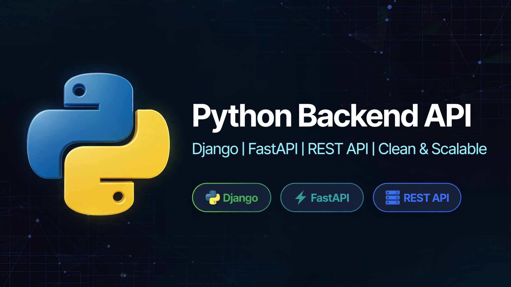

# Python Backend API - GitHub
Backend REST API built with Python (Django / FastAPI) - Clean, scalable and ready for production

## 🚀 Tech Stack
- Python
- Django
- FastAPI
- REST API

## 👨‍💻 Developer
Mamdouh Hassan - Python Backend Developer from Cairo, Egypt
